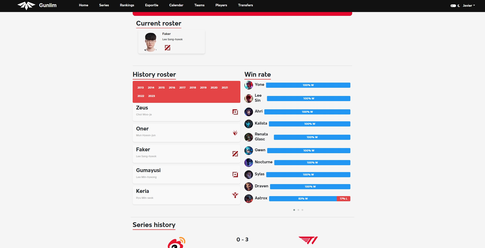

  
  <h1>Gumlin</h1>

# Proyecto de Esports de League of Legends

## 1. Descripción General del Proyecto

El proyecto consiste en una web dedicada a la escena de esports competitiva del videojuego en línea League of Legends. El objetivo es ofrecer a los usuarios la posibilidad de consultar información básica sobre los jugadores y evaluar su rendimiento a través de un sistema de puntuación durante el transcurso de las competiciones locales e internacionales.

La web está diseñada para la comunidad de espectadores de la escena de esports. Los usuarios podrán crear una cuenta para debatir con otros usuarios y compartir su opinión sobre el rendimiento de un jugador o de un equipo en un pequeño foro, además del sistema de puntuación de los jugadores.

### 1.1. Funcionalidad Principal de la Aplicación

La funcionalidad principal consistirá en la creación de un sitio web que permita a los espectadores de la competición de League of Legends acceder a información básica sobre jugadores, equipos y el calendario de las competiciones.

Los usuarios registrados podrán valorar a los jugadores después de finalizar una partida, escribir en el foro una reseña sobre el desempeño de un jugador y debatir con otros usuarios. Además, podrán consultar las alineaciones de los diferentes equipos que participen en una competición en particular, así como sus estadísticas e historial competitivo.

### 1.2. Objetivos Generales

- Objetivo: Proporcionar acceso a información de la escena competitiva e interacción entre la comunidad de espectadores.
- Casos de uso:
  - Usuarios: "Valorar a un jugador", "Ver perfil del jugador", "Escribir en el foro de la partida".
  - Administradores: "Moderar el foro", "Crear publicación de las partidas", "Validar/bloquear usuarios".

## 2. Elemento de Innovación

Se incluirá un minijuego al estilo de Wordle en el que los jugadores intentarán adivinar a un jugador a través de pistas como su nacionalidad, excompañeros y equipos anteriores.

## Vistas del Proyecto

### Página de Inicio

En la página de inicio se mostrará información general sobre la página, tales como:

- Partidos destacados.
- Mercado de fichajes.
- Rankings de los jugadores.

Vista de la página de inicio con el modo noche activado.

---

### Página de Series

En la vista de series, los usuarios podrán:

- Hacer reseñas y comentar sobre las partidas de sus jugadores y equipos favoritos.
- Tener acceso a las estadísticas de los jugadores en las partidas, ya sea el KDA (Kills / Deaths / Assists).
- Ver el personaje que han jugado en cada partida de una serie, ya sea al mejor de 1, 3 o 5 (bo1, bo3 y bo5).

### Retroalimentación de la Comunidad

En Retroalimentación de la Comunidad, los usuarios podrán ver las últimas interacciones de los usuarios para esa serie.

### Comentarios

En la sección de comentarios, los usuarios podrán debatir y comentar sobre las partidas, jugadores o equipos.

Funcionalidades del chat:
- Autocompletado de los apodos de los jugadores usando '@'.
- Autocompletado de los nombres de los equipos usando '#'.
- Los comentarios sobre un jugador o un equipo se reflejarán en el perfil de ambos.

### Predicciones

Los usuarios podrán participar en una encuesta para predecir el resultado de la serie antes de que se juegue.

---

### Rankings

En Rankings, los usuarios podrán:

- Consultar estadísticas.
- Ver los rankings de jugadores, equipos y de los propios usuarios.
- Ver qué usuario es más participativo o cuál es más popular.

---

### Esportle

Esportle es un minijuego basado en el popular juego Wordle. Consiste en adivinar a un jugador por su apodo mediante 5 pistas, las cuales serán:

1. Rol que ocupan en el equipo.
2. Personaje más jugado.
3. Nacionalidad.
4. Equipo actual.
5. Un compañero de equipo.
   

---

### Calendarios

Los usuarios podrán:

- Consultar las partidas programadas para cada mes.
- Consultar sus horarios y plataforma de emisión.
- Acceder a la partida para participar en la predicción.

### Perfiles de Equipo

Los usuarios podrán:

- Consultar los distintos perfiles de los equipos.
- Consultar su historial de jugadores.
- Ver los personajes que juegan (champion pool) junto a los porcentajes de victoria de cada uno.

Los usuarios podrán hacerse fan de los equipos y consultar los comentarios sobre ese equipo por parte de los usuarios.

---

### Perfiles de Jugadores

Los usuarios podrán:

- Consultar los distintos perfiles de los jugadores.
- Consultar su historial de equipos.
- Ver sus personajes más jugados y su personaje favorito.
- Hacerse fans.
- Consultar sus estadísticas.
- Ver los comentarios.

---

### Traspasos

Los usuarios podrán:

- Consultar el mercado de fichajes y renovaciones de los distintos equipos.
- Filtrarlos por ligas.
- Comparar los rosters (plantillas) actuales con los del año pasado.

---

### Perfil

Los usuarios podrán:

- Personalizar las fotos de usuario.
- Personalizar la foto de cabecera de su perfil.
- Personalizar sus datos de redes sociales como Twitter y Discord.
- Indicar de qué equipo son fans.

En el perfil se tendrá acceso a una sección de "Para ti", donde se mostrarán las últimas aportaciones de los usuarios a los que sigues. También se podrá acceder a todos los comentarios y reseñas realizados por el usuario, así como a las cuentas a las que sigues y te siguen.

El perfil incluye: 
- Personalización de apariencia.
- Seguidores y seguidos.
- Un apartado "Para ti" al estilo Instagram con las aportaciones de tus seguidos.
- Los comentarios y reseñas de cada usuario.
- Configuración de los datos personales de cuenta (correo electrónico y contraseña).
- Una biografía de 150 caracteres.
- El logo de tu equipo favorito para que todos tus seguidores lo puedan ver.

  
  
  Formato de reseña de un usuario hacia un jugador con sus estadísticas (K/D/A, campeón jugado de fondo y nota asignada).
  

---

### Panel de Administración

El usuario administrador dispondrá de herramientas para editar los datos de los equipos, partidas y jugadores. Podrá crear nuevos equipos, partidos y usuarios. Tendrá herramientas para controlar los contratos de los jugadores con los equipos, ya sea para renovar jugadores, finalizar su contrato, editar el contrato y terminar con toda relación con el contrato del jugador.

El panel de administración incluye: 
- Edición de jugadores.
- Edición de equipos.
- Edición de partidos.
- Control de usuarios.
- Un menú para editar los contratos de los jugadores con los equipos de una forma precisa y sencilla.
- Un menú para añadir partidas a una serie de forma sencilla y dinámica.

Menú de edición y creación de partidos: 
- Los equipos de League of Legends juegan cada uno en un lado (Red side / Blue side) (campo visitante o local, por hacer un símil con el deporte).
- Botón para cambiar de lado a los equipos.
- Botón estilo on/off para elegir qué equipo es el ganador.

## Fase de Baneo
Es simplemente una fase de la partida donde los equipos banean ciertos campeones de los muchos elegibles para que no los juegue el equipo enemigo.

Edición de equipos.

Creación de nuevas series.

## Función de Administrador para Eliminar Comentarios Inapropiados y Banear Cuentas
Las cuentas baneadas no podrán participar de la comunidad ni hacer reseñas.

## Vista de Registro de la Página

